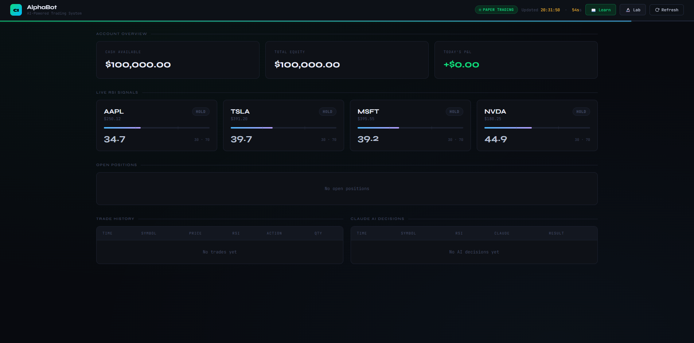
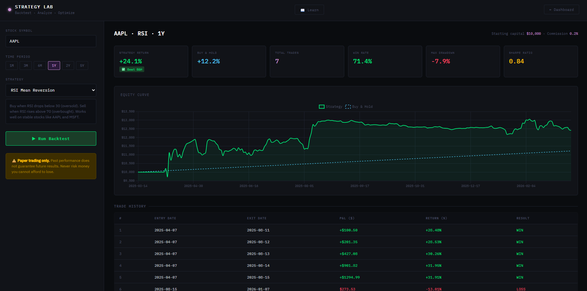
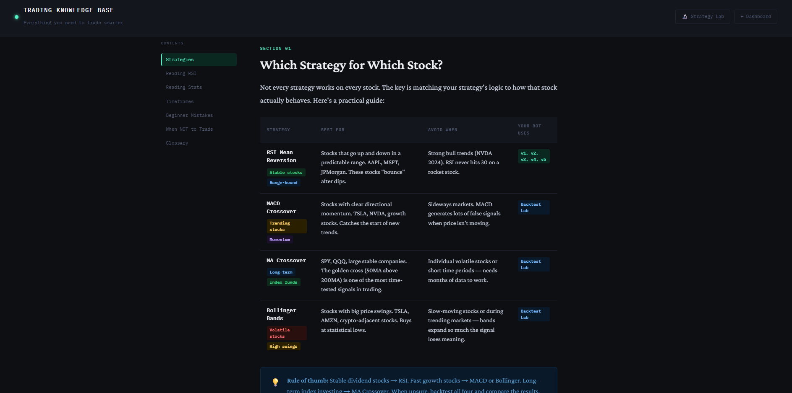

# 🤖 AlphaBot — AI-Powered Stock Trading Bot

> An algorithmic trading bot built with Python, Alpaca API, and Claude AI. Features a live web dashboard, strategy backtesting lab, and multi-layered safety system.


---

## 📸 Screenshots

| Dashboard | Strategy Lab | Learn Page |
|---|---|---|
|  |  |  |

---

## ✨ Features

### 🧠 Trading Strategy
- **Multi-Timeframe RSI** — Daily, Weekly, and Hourly RSI must all agree before buying
- **MACD Confirmation** — Histogram must be rising for 3 consecutive days
- **Claude AI Analysis** — Every trade reviewed by Claude AI before execution
- **Bracket Orders** — Automatic stop-loss (−5%) and take-profit (+10%) on every trade

### 🛡️ Safety System
- Auto-detects NYSE market holidays
- Auto-detects Fed FOMC announcement days
- Auto-detects major economic events (CPI, Jobs Report, GDP)
- Blocks trading during market freefall (SPY down 5%+)
- Skips stocks with earnings within 5 days
- Skips stocks that crashed 10%+ in a single day
- Blocks trading in first/last 30 minutes of session

### 📊 Web Dashboard
- Live RSI signals for all watched stocks
- Open positions with real-time P&L
- Account overview (cash, equity, daily P&L)
- Full trade history log
- Claude AI decision log

### 🔬 Strategy Lab
- Backtest 4 built-in strategies (RSI, MACD, MA Cross, Bollinger Bands)
- Test any stock symbol across 6 time periods (1M → 5Y)
- AI-generated custom strategies via Claude
- Equity curve chart vs Buy & Hold
- Full trade history with WIN/LOSS breakdown

### 📖 Learn Page
- Strategy selection guide
- How to read RSI and backtest stats
- Timeframe selection guide
- Common beginner mistakes
- When NOT to trade
- Full trading glossary (21 terms)

---

## 🏗️ Project Structure

```
trading-bot/
├── bot.py              # Main entry point — runs the bot
├── config.py           # All settings (watchlist, risk %, thresholds)
├── strategy.py         # RSI + MACD + Claude AI logic
├── orders.py           # Order execution (bracket orders)
├── safety.py           # All safety checks
├── logger.py           # CSV trade logging
├── skip_days.py        # Auto-detects holidays, FOMC, CPI days
├── dashboard.py        # Flask web server
├── backtest.py         # Standalone backtest script
├── bot_log.csv         # Auto-generated trade log
└── templates/
    ├── index.html      # Live dashboard
    ├── backtest.html   # Strategy lab
    └── learn.html      # Trading education
```

---

> 📋 **Detailed setup guide:** [SETUP.md](SETUP.md)

## 🚀 Quick Start

### 1. Clone the repository
```bash
git clone https://github.com/MertOzyalcin/trading-bot.git
cd trading-bot
```

### 2. Create virtual environment
```bash
python -m venv venv
venv\Scripts\activate        # Windows
source venv/bin/activate     # Mac/Linux
```

### 3. Install dependencies
```bash
pip install alpaca-py pandas ta schedule python-dotenv anthropic flask yfinance backtesting certifi pandas-market-calendars beautifulsoup4 requests
```

### 4. Create your `.env` file
```
API_KEY=your_alpaca_api_key
SECRET_KEY=your_alpaca_secret_key
ANTHROPIC_KEY=your_anthropic_api_key
```

### 5. Run the bot
```bash
python bot.py
```

### 6. Open the dashboard
```
http://localhost:5000
```

---

## ⚙️ Configuration

All settings are in `config.py`. Key options:

```python
# Which stocks to watch
WATCHLIST = ["AAPL", "TSLA", "MSFT", "NVDA"]

# Risk management
RISK_PCT   = 0.02   # Risk 2% of account per trade
STOP_PCT   = 0.05   # Stop-loss at -5%
PROFIT_PCT = 0.10   # Take-profit at +10%

# RSI thresholds
RSI_BUY  = 30       # Buy when RSI drops below this
RSI_SELL = 70       # Sell when RSI rises above this

# Multi-timeframe filters
MTF_WEEKLY_MAX = 50  # Weekly RSI must be below this
MTF_HOURLY_MAX = 40  # Hourly RSI must be below this

# Live trading (default: paper trading)
PAPER_TRADING = True  # Set to False for live trading
```

---

## 📈 How the Bot Decides to Trade

Every BUY order must pass 6 gates:

```
Gate 1 → Daily RSI < 30          (oversold signal)
Gate 2 → No crash / No earnings  (safety check)
Gate 3 → MACD histogram rising   (momentum confirmation)
Gate 4 → Weekly RSI < 50         (big trend neutral)
Gate 5 → Hourly RSI < 40         (good entry timing)
Gate 6 → Claude AI approves      (qualitative judgment)
```

---

## ⚠️ Disclaimer

This project is for **educational purposes only**. It is not financial advice. Past performance does not guarantee future results. Always paper trade before using real money. Never risk money you cannot afford to lose.

---

## 🛠️ Tech Stack

| Layer | Technology |
|---|---|
| Language | Python 3.10+ |
| Brokerage API | Alpaca Markets |
| AI Analysis | Anthropic Claude |
| Technical Analysis | `ta` library |
| Data | yfinance, Alpaca Data API |
| Web Framework | Flask |
| Frontend | HTML / CSS / JavaScript / Chart.js |
| Backtesting | backtesting.py |
| Scheduling | schedule |

---

## 👨‍💻 Author

**Mert Özyalçın**
- GitHub: [@MertOzyalcin](https://github.com/MertOzyalcin)

---

## 📄 License

MIT License — free to use, modify, and distribute.
